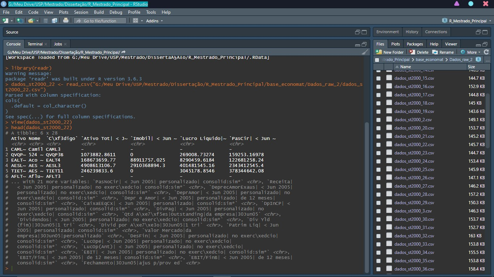

# ECO1
Research of the relantionship between economical political uncertainty and corporate investment in Brazil

This repository aims to make public all methods and codes used to do a econometric research in a master's level.

From the minning of almost 100 datasets of financial data from Brazil in its unstructured raw state (acess in raw_data) as show in the picture below:

/raw_data - All data used in the project. 
/R - R codes to clean the data, set to panel, analyze it and run regression models. (in progress)

All work description, references and methodology will be put on a paper, the link for it will be ready soon.
