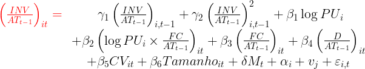
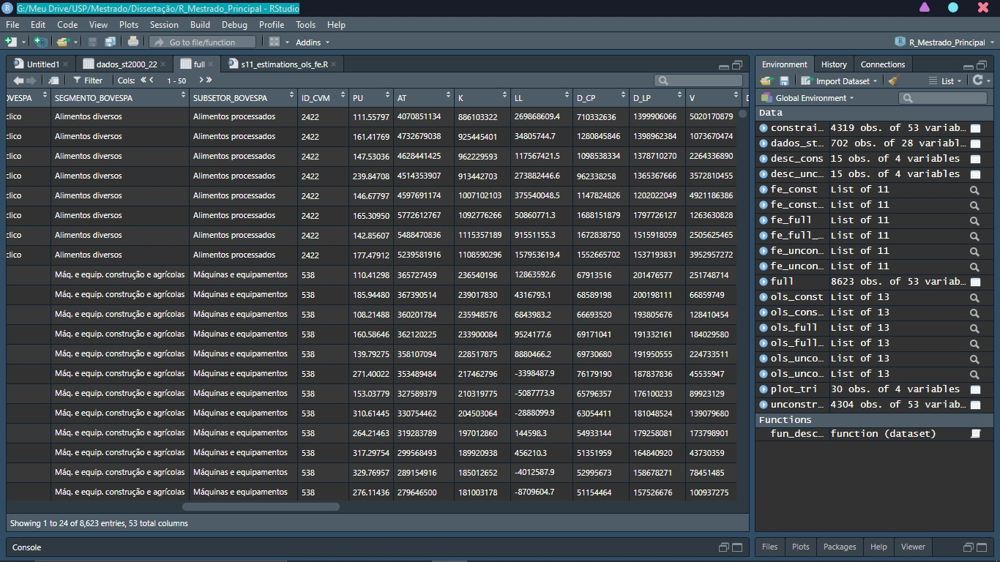
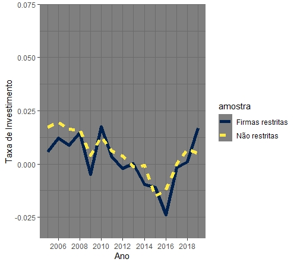

# Research of the relantionship between economical political uncertainty and corporate investment in Brazil

This repository aims to make public all methods and codes used to do a econometric research in a master's level.

This research focus in understanding how the political enviroment in Brazil affects corporate investment decisions, to do this we gather financial data from Economatica 2006-2019 and analyze it using a modified accelerator investment model:

# Work done
From the minning of almost 100 datasets of financial data from Brazil in its unstructured raw state (acess in raw_data):

To a structured dataset with all variables needed to the research and graphical analysis:

And finally all regression method utilized (OLS/FE/System-GMM) in R and Stata are made public here and can be freely accessed.

The full description of the research can be accessed in the final paper, the link will be updated here as soon as the paper is done.

